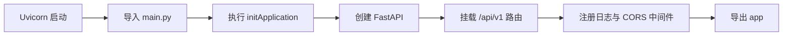
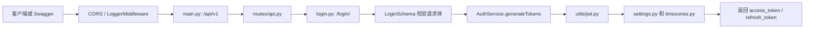

# FastAPI 项目学习笔记

## 1. 这个项目在讲什么

这是一个典型的 FastAPI 后端项目：使用带版本的路由提供 API，并将接口处理、数据校验与业务逻辑分层。项目还包含 Docker、Redis 和 RQ 异步任务相关运行配置。

可以从中学习：

- FastAPI 应用如何启动、注册中间件和挂载路由。
- 通过 `http://127.0.0.1:8000/docs` 使用 FastAPI 自动生成的接口文档调试 API。
- 后端分层的职责划分。
- `.env` 与 `settings.py` 的配置管理方式，以及不要把密钥提交到 Git 的安全习惯。
- 用 Docker Compose 一次启动 API、RQ Worker 和 Redis。
- 后续可以练习新增一个小接口、补充 Pydantic 校验、为接口编写 pytest 测试。

## 2. 项目目录分层：和 Spring Boot 的对应关系

| FastAPI 位置 | Spring Boot 中常见概念 | 职责 |
| --- | --- | --- |
| `app/api/controllers/` | `@RestController` | 接收 HTTP 请求、调用业务逻辑、返回 HTTP 响应 |
| `app/schemas/` | DTO / RequestBody 类 / VO | 定义请求和响应的数据结构，并进行校验 |
| `services/` | `@Service` | 执行真正的业务逻辑，如注册、查询、计算等 |
| `routes/api.py` | 路由配置 | 组织并挂载不同接口 |

控制器应该保持轻量：它负责接收请求和返回结果；可复用的校验写在 Schema 中；真正的领域和业务逻辑写在 Service 中。

## 3. 什么是请求/响应校验

请求和响应校验不是 Apifox 一类接口工具做的事情。

- **Apifox**：外部的接口调试、测试工具。它可以帮我们发送请求、查看响应、保存接口文档。
- **Schema / DTO 校验**：后端程序自身的规则和安全边界。即使有人不用 Apifox，而是直接调用接口，后端仍然会拦住不合法的数据。

例如，注册接口要求邮箱和密码：邮箱必须是合法邮箱，密码至少 6 位。后端会在执行业务逻辑前自动检查这些规则；不符合时直接返回错误响应（FastAPI 常见为 `422`），业务代码不会继续运行。

这和 Spring Boot 中的 `@Valid`、`@RequestBody`、`@NotBlank`、`@Email`、`@Min` 等校验机制属于同一类思想。

响应校验则约束后端返回什么。例如数据库中的用户对象可能有 `password_hash`，但接口不能把它返回给前端；定义响应 Schema 后，可以只公开允许返回的字段，并确保返回格式符合接口约定。

## 4. Pydantic 是什么

`pydantic` 是 Python 的第三方数据校验库，FastAPI 经常用它来描述接口接收和返回的数据。

它主要能做两件事：

- **校验数据**：例如检查邮箱格式、密码长度、数字类型。
- **转换数据**：例如尝试将字符串 `"18"` 转换为整数 `18`。

它不是本项目自己定义的包，而是通过 `pip install` 安装的依赖。FastAPI 会借助 Pydantic 自动完成请求和响应的校验。

## 5. 读懂 Pydantic 的导入语句

```python
from pydantic import BaseModel, EmailStr, Field
```

意思是：从 `pydantic` 这个包中取出多个可用的名称。

这类似 Java 分别导入多个类：

```java
import 某个包.BaseModel;
import 某个包.EmailStr;
import 某个包.Field;
```

它们的作用并不相同：

- `BaseModel`：一个基础类，供我们定义的数据模型继承。
- `EmailStr`：一个邮箱字符串类型，用来要求字段必须符合邮箱格式。
- `Field`：一个函数，用来补充字段规则，例如最小长度。

## 6. 示例：读懂注册请求模型

下面的 `RegisterRequest` 是为了讲解 Pydantic 而写的独立示例，不是本项目当前已经存在的注册接口。本项目实际使用的是 `app/schemas/auth/LoginSchema.py` 中的 `LoginSchema`。

```python
from pydantic import BaseModel, EmailStr, Field


class RegisterRequest(BaseModel):
    email: EmailStr
    password: str = Field(min_length=6)
```

`RegisterRequest` 是一个“注册请求的数据模型”。它规定：

- `email` 必须是符合邮箱格式的字符串。
- `password` 必须是字符串，并且至少 6 个字符。

### `class RegisterRequest(BaseModel)` 的括号是什么意思

这里的括号不是在给 `RegisterRequest` 传参数，而是在说明继承关系：`RegisterRequest` 继承 `BaseModel`。

它相当于 Java：

```java
public class RegisterRequest extends BaseModel {
}
```

继承 `BaseModel` 后，`RegisterRequest` 就拥有 Pydantic 的自动解析和校验能力。

真正创建对象、传入数据时，才会写成：

```python
request = RegisterRequest(
    email="test@example.com",
    password="123456"
)
```

这才相当于 Java 的对象创建：

```java
RegisterRequest request = new RegisterRequest(
    "test@example.com",
    "123456"
);
```

类也可以在创建对象时接收参数，本质上是在调用它的构造逻辑；但 `class RegisterRequest(BaseModel)` 中的括号用途是继承，不是构造参数。

## 7. Git：本地修改、Fork 与远程仓库

修改代码前不需要先 Fork。克隆到本地后，随时可以修改、执行 `git add` 和 `git commit`；这些提交首先只存在本机。

之后能否推送、推送到哪里，取决于远程仓库权限：

- 原仓库是自己的，或自己有写权限：可以直接 `git push` 到原仓库。
- 原仓库是别人的且没有写权限：通常先在 GitHub Fork 一份，再将本地远程指向自己的 Fork；若想把修改贡献回原项目，再发起 Pull Request（PR）。
- 只是个人实验：也可以不 Fork，在自己的 GitHub 新建空仓库后，将本地 `origin` 改为该仓库再推送。

为了既保留原项目更新来源，又能自由推送到自己的仓库，推荐这样配置：

```powershell
git remote rename origin upstream
git remote add origin https://github.com/你的用户名/你的-fork仓库.git
git push -u origin main
```

其中：

- `upstream`：原项目仓库，可用来同步上游更新。
- `origin`：自己的 Fork，可自由推送代码。

本项目当前远程仓库指向原示例仓库，且当前分支名是 `master`。在你拥有明确推送目标和权限前，只练习本地 `git add`、`git commit` 和 `git log`，不要直接执行 `git push`。

## 8. 新手应该按什么顺序学习

建议不要一上来逐个看完所有文件。按“能看到结果的最短路径”学习会更容易坚持：

1. **先跑起来**：用 Windows PowerShell 启动 Uvicorn，打开 `/docs`，亲眼看到接口文档。
2. **再发一次请求**：调用 `POST /api/v1/login/`，分别观察成功响应和 `422` 校验失败响应。
3. **沿调用链读代码**：从 `main.py` 进入路由、Controller、Schema、Service，最后到 JWT 工具。
4. **理解横切能力**：再学习配置、日志、中间件和 CORS，它们会影响所有接口。
5. **最后学习容器和异步任务**：Docker、Redis 和 RQ 是运行方式与扩展能力，不是读懂第一个接口的前置条件。
6. **再进入测试和改代码练习**：先确认测试依赖，再新增测试；不要为了练习直接修改认证逻辑。

每一步的命令、预期结果和排错方式在 [Windows 10 入门手册](FastAPI项目入门手册-Windows10.md) 中。完成一项再打勾，不需要一次全部完成。

## 9. 先认识真实目录，而不是 README 的示意结构

原英文 README 中展示的是通用模板，和当前仓库的实际位置并不完全一致。例如 `services/`、`routes/`、`utils/` 在项目根目录，而不是 `app/` 内。阅读代码时以下表为准：

| 实际位置 | 当前职责 | Spring Boot 类比 |
| --- | --- | --- |
| `main.py` | 创建 `FastAPI`，注册路由和中间件，导出 `app` | `@SpringBootApplication` + Web 配置 |
| `routes/api.py` | 汇总各 Controller 的 `APIRouter` | 统一的 `@RequestMapping` 或路由配置 |
| `app/api/controllers/` | 定义 HTTP 接口函数 | `@RestController` |
| `app/schemas/` | 描述请求数据 | DTO + `@RequestBody` |
| `services/` | 组织业务逻辑 | `@Service` |
| `utils/` | JWT、日志、时区等通用能力 | 工具类 / 基础设施组件 |
| `app/middlewares/` | 请求进入和离开接口前后的通用处理 | Filter / HandlerInterceptor |
| `settings.py` | 读取运行配置 | `application.yml` + `@ConfigurationProperties` |

## 10. 应用是怎样启动的

启动命令是：

```powershell
.\.venv\Scripts\python.exe -m uvicorn main:app --reload
```

其中 `main:app` 的意思是：导入 `main.py` 模块，并取得其中名为 `app` 的对象。导入 `main.py` 时会执行最后一行 `app = initApplication()`，所以应用创建、路由注册、中间件注册以及当前的依赖注入演示打印都会发生在启动阶段。



`Database` 和 `UserService` 目前是理解单例与手动依赖注入的演示代码，不是真实数据库连接。启动时打印 `User 1 fetched...` 也属于这个演示的副作用。

## 11. 一次登录请求走过哪些文件

以 `POST /api/v1/login/` 为例：



完整地址由三段前缀拼出来：

- `main.py`：`/api/v1`
- `login.py` 中的 Router：`/login`
- 路由函数：`/`

因此最终是 `/api/v1/login/`。这也是为什么路由前缀集中管理比在每个接口手写版本号更容易维护。更多背景见 [版本化路由专题笔记](学习笔记-版本化路由.md)。

## 12. Schema、Controller、Service 各自只做什么

`LoginSchema` 继承 `BaseModel`，当前只要求 `email` 与 `password` 两个字段存在并能解析成字符串。它**还没有**要求邮箱格式或密码长度；不要把示例中的 `EmailStr`、`Field(min_length=6)` 误认为项目现状。

- Controller `loginUser`：接收已经解析好的 `LoginSchema`，调用 Service，返回 HTTP 响应。
- Service `AuthService`：负责“生成两种令牌”这个业务动作，不应关心 URL 或 HTTP 请求对象。
- `utils/jwt.py`：负责令牌编码/解码这一通用技术细节。

这就是“Controller 薄、Service 放业务、Schema 放数据规则”的分层。以后增加真实用户校验时，应该补充 Service 和数据访问层，而不是把密码判断全部堆进 Controller。

## 13. 配置、日志、中间件与 CORS

`settings.py` 的 `Settings(BaseSettings)` 会从 `.env` 读取同名配置，并在没有配置时使用代码中的默认值。当前 `TOKEN_SECRET_KEY` 和 `secret_key` 是演示默认值，真实项目必须放在本机 `.env` 或部署平台的密钥管理中。

`LoggerMiddleware` 会记录每一次 HTTP 请求的状态码、客户端地址、方法、URL 和耗时。`utils/log.py` 会将日志写入 `logs/`，该目录已被 Git 忽略。

`CORSMiddleware` 用于浏览器跨域访问控制。这里的 `ALLOWED_HOSTS` 实际被用作 CORS 的 `allow_origins`，名称容易和“允许的 HTTP Host”混淆；本轮只记录这一点，不擅自重构配置名。

## 14. 已启用、示例和未实现的内容

| 项目部分 | 当前状态 | 学习时应如何理解 |
| --- | --- | --- |
| `LoggerMiddleware` | 已在 `main.py` 注册 | 真实请求会经过它 |
| `exampleMiddleware.py` | 未注册 | 用来了解原生 ASGI 中间件写法 |
| `dependencies/dependency.py` | 未接入路由 | 用来了解 FastAPI 的 `Depends` 前置校验写法 |
| `Database` / `UserService` | 启动时演示 | 不是实际数据库层 |
| `database/` | 空目录 | 不能认为项目已接入数据库 |
| 🚩Redis / RQ Worker | Compose 已配置 | 当前没有入队代码，Worker 等待任务正常 |

## 15. Docker、Redis 与 RQ 要学到什么

### 15.1 整体定位

Docker 不是本地启动的前置条件，而是后续容器化练习。前五个阶段用 `python -m uvicorn ...` 直接在 Windows 本地运行项目，阶段六则用 Docker 容器来运行整个项目，体验"生产环境"风格的部署。

### 15.2 Dockerfile：单个容器的打包说明书

Dockerfile 告诉 Docker 怎么把项目变成一个可运行的容器镜像。它决定的是**"容器里有什么"**（环境、依赖、代码文件），而不是"容器启动后跑什么程序"。

```dockerfile
FROM python:3.11-slim-buster          # 基础镜像：精简的 Linux + Python 3.11
ENV PYTHONDONTWRITEBYTECODE 1         # 不生成 .pyc 缓存文件（保持容器干净）
ENV PYTHONUNBUFFERED 1                # Python 输出不被缓冲（方便看日志）
WORKDIR /app                          # 容器内的工作目录
COPY requirements.txt .               # 复制依赖清单进容器
RUN pip install --no-cache-dir -r requirements.txt  # 安装 Python 依赖
COPY . .                              # 复制项目所有代码进容器
CMD ["uvicorn", "main:app", "--host", "0.0.0.0", "--port", "8000"]  # 默认启动命令
```

### 15.3 docker-compose.yml：多个容器的编排表

如果 Dockerfile 是**一个容器的说明书**，那 `docker-compose.yml` 就是**多个容器的编排表**。一条 `docker compose up --build` 命令就能同时构建镜像并启动所有容器。

`docker compose up --build` 实际上做了两件事：

1. **build**：先构建镜像（读 Dockerfile，装依赖，拷代码）。
2. **up**：再启动容器（用构建好的镜像运行容器）。

项目定义了三个服务（容器）：

| 服务 | 镜像来源 | 启动后执行什么 | 角色 |
| --- | --- | --- | --- |
| `app` | 用 Dockerfile 本地构建 | `CMD` 里写的：`uvicorn main:app ...` | Web 服务器，接收 HTTP 请求 |
| `worker` | 用**同一个** Dockerfile 本地构建 | `command` 覆盖为：`rq worker --url redis://redis:6379 default` | 后台任务处理器，从 Redis 取任务执行 |
| `redis` | 直接从 Docker Hub 下载 `redis:alpine` 官方镜像 | Redis 自身默认启动命令 | 内存数据库 / 消息队列 |

三个容器通过内部网络 `fast-api-network` 互相通信，不需要手动安装 Redis 或配置环境。

### 15.4 关键概念：同一个镜像，不同的启动命令

`app` 和 `worker` 用的是**同一个 Dockerfile**，构建出的是**同一个镜像**（里面什么都有——FastAPI 代码、RQ 代码、所有依赖）。区别只在于 `docker-compose.yml` 中 worker 的 `command` 字段覆盖了 Dockerfile 里的 `CMD`：

- **app 容器**：执行 Dockerfile 默认的 `CMD`，启动 Uvicorn 当 Web 服务器。
- **worker 容器**：`command: rq worker --url redis://redis:6379 default` 覆盖默认命令，启动 RQ Worker 监听 `default` 队列。

打个比方：同一个镜像就像同一间装修好的厨房——灶台、锅碗、食材都一样。但厨师进门后，可以做完全不同的菜。

### 15.5 worker 的命令在干什么

```
rq worker --url redis://redis:6379 default
│  │      │                        │
│  │      │                        └── 监听名为 "default" 的队列
│  │      └── 连接到 Redis（地址是 redis 容器的 6379 端口）
│  └── 启动一个 RQ Worker（后台任务处理器）
└── RQ = Redis Queue，一个 Python 的轻量任务队列库
```

worker 启动后会一直等待 Redis 队列中的任务。当前项目没有 RQ 入队代码，所以 Worker 空闲等待属于正常状态。

### 15.6 构建与启动的完整流程

```
执行 docker compose up --build
    │
    ├── 1. redis 服务：本地没有 redis:alpine 镜像？从 Docker Hub 下载
    │
    ├── 2. app 服务：读 Dockerfile → 装 Python → 装依赖 → 拷代码 → 构建出 app 镜像
    │
    ├── 3. worker 服务：用同一个 Dockerfile 构建（镜像和 app 一样）
    │
    └── 4. 三个镜像都就绪，启动三个容器，各自执行自己的启动命令
```

如果镜像已经构建过，再次执行 `docker compose up`（不带 `--build`）会直接复用已有镜像，跳过构建。`--build` 是强制"每次都重新构建"，适合改了代码之后用。

停止容器：前台按 `Ctrl+C`；如需移除本项目容器和网络，执行 `docker compose down`（不会删除项目源码）。

### 15.7 学习边界

不要因为看到 Worker 就误以为登录接口会自动异步执行；当前代码没有调用 RQ 入队 API。

### 15.8 阶段六实操验证记录

Docker Desktop 已安装并配置镜像加速器（国内拉取 Docker Hub 镜像需要）。`docker compose up --build` 成功启动三个容器，验证结果：

| 验证命令 | 预期结果 | 实际结果 |
| --- | --- | --- |
| `docker compose ps` | 三个容器均为 Up 状态 | ✅ app、redis、worker 全部运行 |
| `docker compose exec redis redis-cli ping` | 返回 PONG | ✅ PONG |
| `docker compose logs worker` | Worker 监听 default 队列 | ✅ Listening on default... |

关键认知：

- Worker 空闲等待是正常的，当前没有 RQ 入队代码。
- `docker compose up` 不带 `--build` 可复用已有镜像，跳过构建。
- 停止容器用 `Ctrl+C`（前台）或 `docker compose down`（移除容器和网络，不删源码）。
- `docker-compose.yml` 中的 `version` 字段已被 Docker Compose 标记为过时，不影响功能，可忽略警告。

## 16. 测试现状与正确的下一步

仓库当前没有 `tests/` 目录，不能说“测试已通过”。目前适合的验证是：编译核心模块、启动 Uvicorn、访问 OpenAPI、发送成功和失败的 HTTP 请求。

本机现有虚拟环境中，导入 `FastAPI TestClient` 时发现没有安装测试客户端依赖；当前 Starlette 会优先提示 `httpx2`，而 FastAPI 官方教程推荐 `httpx`。这不是现在自动安装依赖的理由。等你学到测试章节时，先把错误原文发给我，我会解释版本关系、给出最小开发依赖方案，得到你的确认后再改动依赖文件。

## 17. 后续练习建议

完成现有调用链后，可以按顺序练习：

1. 为登录请求增加明确的邮箱与密码规则，并观察 `422` 返回。
2. 新增一个不访问数据库的健康检查接口，练习 Router 和 Controller。
3. 为登录成功和缺少字段两种情况写 FastAPI TestClient 测试。
4. 在 Docker 环境确认 Redis 和 Worker 状态。
5. 单独设计“最小 RQ 入队任务”练习，再决定是否新增接口。

以上练习都属于后续改动：先讨论、你确认后再做，不直接改动本轮的演示登录逻辑。
噢您好呀唉。
## 18. Python 基础语法：`self`、对象创建与类的高级特性

### 18.1 `self` 是什么

`self` 是类的实例方法中对**当前对象实例**的引用，类似于 Java 中的 `this`。

```python
class Database:
    def __init__(self):
        self.connection_string = "Database Connection Established"  # 赋值：把值存到对象里

    def connect(self):
        return self.connection_string  # 取值：把之前存的值返回
```

- `__init__` 中的 `self.connection_string = ...` 是**赋值**，把值绑定到当前对象。
- `connect` 中的 `return self.connection_string` 是**取值并返回**。

一个类可以被实例化多次，每次创建的实例都是独立的：

```python
db1 = Database()
db2 = Database()
```

调用 `db1.connect()` 时，Python 自动把 `db1` 作为 `self` 传入，因此 `self.connection_string` 访问的是 `db1` 的属性，而不是 `db2` 的。

`self` 不是 Python 关键字，只是社区约定。写成 `this` 也能运行，但没人这么做。

### 18.2 `self` 是谁传的

`self` 由 **Python 解释器自动传入**，不需要手动传递。

```python
# 以下两种写法完全等价
db.connect()            # Python 自动把 db 作为 self 传入
Database.connect(db)    # 手动把 db 作为 self 传入
```

创建实例 `db = Database()` 时：

1. Python 在内存中创建一个新的 `Database` 对象。
2. Python 自动调用 `__init__(self)`，并自动把刚创建的对象作为 `self` 传入。
3. `self.connection_string = "..."` 把属性绑定到这个新对象上。

### 18.3 Python 创建对象不需要 `new`

Python 创建对象直接 `类名()`，不需要 `new` 关键字：

| 语言 | 创建对象语法 |
| --- | --- |
| Java | `Database db = new Database();` |
| Python | `db = Database()` |

括号的作用是调用类的构造函数（触发 `__init__` 方法）。

其他常见基础语法对比：

```python
# 变量声明（不需要指定类型，不需要分号）
name = "张三"
age = 25
is_active = True

# 列表（类似 Java 的 ArrayList）
fruits = ["apple", "banana"]

# 字典（类似 Java 的 HashMap）
user = {"name": "张三", "age": 25}

# 条件判断（不需要括号，用缩进代替花括号）
if age > 18:
    print("成年")
else:
    print("未成年")

# 循环
for fruit in fruits:
    print(fruit)
```

### 18.4 `metaclass=SingletonMeta` 是什么意思

`class Database(metaclass=SingletonMeta)` 中的 `metaclass=` **不是继承**，而是指定"元类"。

| 概念 | 作用 | 类比 |
| --- | --- | --- |
| 类 | 定义对象的属性和行为 | 做月饼的模具 |
| 继承 | 子类复用父类的代码 | 儿子继承父亲的财产 |
| 元类 | 控制"类"本身的创建和行为 | 做模具的模具 |

`SingletonMeta` 是一个**单例元类**，它的作用是：让这个类只能创建一个实例，无论调用多少次 `Database()`。

```python
# 有 SingletonMeta 单例元类
db1 = Database()
db2 = Database()
print(db1 is db2)  # True！是同一个对象，共用同一份数据
```

数据库连接这种资源全局只需要一个，用单例避免重复创建浪费资源。

### 18.5 什么时候方法参数要写 `self`

| 情况 | 是否写 self | 说明 |
| --- | --- | --- |
| 实例方法（操作具体对象的） | ✅ 要写 | `def connect(self):` |
| 类方法（操作类本身的） | ❌ 写 `cls`，加 `@classmethod` | `@classmethod` / `def create(cls):` |
| 静态方法（跟类/对象都没关系） | ❌ 不写，加 `@staticmethod` | `@staticmethod` / `def helper():` |

**判断标准**：这个方法需要访问"这个对象"自己的属性或方法吗？需要就写 `self`，不需要就不写。

```python
class Calculator:
    # 实例方法：需要访问对象的值
    def get_value(self):
        return self.value

    # 静态方法：纯计算，跟对象无关
    @staticmethod
    def add(a, b):
        return a + b
```

### 18.6 Python 类可以动态添加属性

Python 不需要在类中提前声明属性，可以直接给对象赋值：

```java
// Java：必须先声明属性，否则编译报错
Database db = new Database();
db.newField = "xxx";  // ❌ 编译错误
```

```python
# Python：不需要提前声明，随时可以加属性
db = Database()
db.new_field = "xxx"  # ✅ 完全合法，动态添加了一个新属性
print(db.new_field)   # 输出: xxx
```

| 特性 | Java | Python |
| --- | --- | --- |
| 类型检查 | 编译时检查，属性必须提前声明 | 运行时动态，随时可以加 |
| 属性定义 | 必须在类里声明 | 可以在 `__init__` 里"用出来"，也可以随时加 |

虽然 Python 允许动态添加属性，但好的做法还是**在 `__init__` 里统一声明所有属性**，让代码清晰可读：

```python
# ✅ 推荐
class Database:
    def __init__(self):
        self.connection_string = None
        self.timeout = 30
        self.is_connected = False

# ❌ 不推荐：到处乱加属性，别人不知道有哪些
db = Database()
db.connection_string = "..."
db.extra_field = "???"  # 突然冒出来一个，很混乱
```
